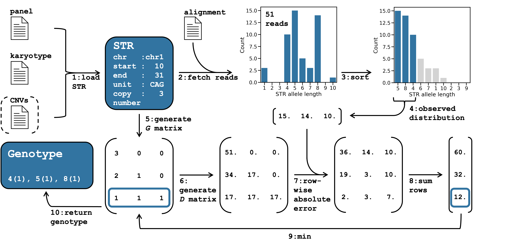

# ConSTRain: copy number guided STR allele inference

ConSTRain is a short tandem repeat (STR) variant caller that can account for copy number variants (CNVs), aneuploidies, and polyploid genomes.
It is accurate and fast, needing less than 20 minutes to genotype >1.7 million STRs in a 100X alignment of human whole-genome sequencing reads on 32 threads.

*   [Method overview](#method-overview)
*   [Installation](#installation)
*   [Running ConSTRain](#running-constrain)
*   [Command line arguments](#command-line-arguments)
*   [Input files and their formats](#input-file-formats)

## Method overview
To infer STR genotypes, ConSTRain generates all possible allele length distributions for each locus and returns the one that best matches the observed allele length distribution.
An overview of how ConSTRain works internally is shown below.



*ConSTRain overview and example. 
**(1)** An STR locus are loaded from the input files. 
The locus reference information is parsed from the STR panel. 
The STR copy number is set based on the karyotype, and optionally updated if the STR is affected by a CNV. 
**(2)** Reads overlapping the STR region are extracted from the alignment file, and the length of the STR region in each read is determined. 
**(3)** The observed distribution is sorted, and at most as many allele lengths as the STR copy number are kept. 
**(4)** This yields the final observed allele length distribution. 
**(5)** Next, all possible genotypes are generated for the STR copy number and stored in matrix **G**. 
**(6)** From **G**, the matrix **D** is generated by multiplying it with the total number of mapped reads (51 in the example) divided by the STR copy number (3 in the example). 
Each row in **D** corresponds to the expected allele length distribution of one of the genotypes in **G**. 
**(7)** The expected distribution with the lowest error to the observed distribution is found by taking the absolute difference between each row in **D** and the observed distribution, then **(8)** taking the sum of rows and finding the one with the lowest value. 
**(9)** The genotype in **G** with the lowest error is selected **(10)** and reported in the output.
The inferred genotype of the STR locus in this example consists of an allele of 4 `CAG` units (present once), an allele of 5 `CAG` units (present once), and an allele of 8 `CAG` units (also present once).*

## Installation
### Building from source
In order to build ConSTRain from the source code, you will need to [install the Rust programming language](https://www.rust-lang.org/tools/install).
Then, clone this repository and build ConSTRain as follows:

```bash
git clone https://github.com/acg-team/ConSTRain.git
cd ConSTRain/ConSTRain
cargo build --release --bin ConSTRain
```

The binary will be created at `./target/release/ConSTRain` (alternatively, `cargo install --path .` from within the `ConSTRain/ConSTRain` directory will create the binary and put it in `~/.cargo/bin` ).

### Possible issues
#### libclang is not found
Building `hts-sys` fails with the following error: 
```bash
Unable to find libclang: "couldn't find any valid shared libraries matching: ['libclang.so', 'libclang-*.so', 'libclang.so.*' 'libclang-*.so.*'], set the LIBCLANG_PATH environment variable to a path where one of these files can be found (invalid: [])"
```

This is caused because `Bindgen` requires `libclang`. The problem can be solved by installing `clang` (see instructions [here](https://rust-lang.github.io/rust-bindgen/requirements.html)) or, if it is already installed, providing the location of the directory containing `libclang.so` through the `LIBCLANG_PATH` environment variable:
```bash
LIBCLANG_PATH=/path/to/clang/lib cargo build --release --bin ConSTRain
```

#### System header files are not found
Building `hts-sys` fails with an error like this:
```bash
./htslib/htslib/hts.h:31:10: fatal error: 'stddef.h' file not found
```

Caused because some system header file (e.g., `stddef.h`) is not found. Address this by providing the location of the directory containing system header files through the `C_INCLUDE_PATH` environment variable:
```bash
C_INCLUDE_PATH=/path/to/include cargo build --release --bin ConSTRain
```

## Running ConSTRain
Some basic ConSTRain invocations are shown here.
For details on all command line arguments, run `ConSTRain --help` or go to the [command line arguments](#command-line-arguments) section below.

Calling STR variants from aligned sequencing reads is done via the `ConSTRain alignment` subcommand.
To run, `ConSTRain alignment` needs at least a BED file specifiying locations of STRs in the reference genome, a JSON file encoding the target chromosomes and their ploidies, and an alignment in SAM/BAM/CRAM format.
For some species, input files are provided in [resources](./resources/) directory (currently, only *Homo sapiens* and *Musa acuminata*).
A basic `ConSTRain alignment` invocation looks like this:

```bash
ConSTRain alignment -a <ALIGNMENT> -k <KARYOTYPE> -r <REPEATS>
```

By default, ConSTRain prints logging information up to and including 'info' level to stderr. 
To enable more in-depth logging information, set the `RUST_LOG` environment variable, e.g.:

```bash
RUST_LOG=debug ConSTRain alignment -a <ALIGNMENT> -k <KARYOTYPE> -r <REPEATS>
```

If you know there are CNVs in the sample you're analysing, ConSTRain can account for these if you supply the affected regions as a BED file via the `--cnvs` flag:

```bash
ConSTRain alignment -a <ALIGNMENT> -k <KARYOTYPE> -r <REPEATS> --cnvs <CNVs>
```

### Re-running ConSTRain on a VCF file
Once an alignment has been analysed using `ConSTRain alignment` the generated VCF file can be used to re-run ConSTRain.
This is useful if you decide you want to use different filtering parameters, or maybe you have access to new CNV information that was not available when you first analysed a sample.
Rather than having to analyse the alignment again, you can use the `ConSTRain vcf` subcommand to re-estimate STR genotypes.
This is possible because ConSTRain includes the observed allele length distribution for each STR as a FORMAT field in the VCF file.
Running `ConSTRain vcf` is typically a matter of a few seconds.

The basic invocation of `ConSTRain vcf` is:

```bash
ConSTRain vcf -v <VCF> -k <KARYOTYPE> -r <REPEATS>
```

Again, you can add CNV information via the `--cnv` flag:

```bash
ConSTRain vcf -v <VCF> -k <KARYOTYPE> -r <REPEATS> --cnvs <CNVs>
```

## Command line arguments
All of ConSTRain's command line arguments are listed here.
For details on expected formats of the CNV, karyotype, and repeat file, see the section on [input file formats](#input-file-formats) below.

| long             | short | subcommand | required      | default              | description                                                                                                                                                                                                                |
|------------------|-------|------------|---------------|----------------------|----------------------------------------------------------------------------------------------------------------------------------------------------------------------------------------------------------------------------|
| --alignment      | -a    | alignment  | y             |                      | Input file to extract repeat allele lengths from. Can be SAM/BAM/CRAM                                                                                                                                                      |
| --cnvs           |       | both       | n             |                      | Copy number variants for this individual. Expected format is BED3+1                                                                                                                                                        |
| --flanksize      |       | alignment  | y             | 5                    | Size of flanking region around the target repeat that reads need to cover to be considered (both sides)                                                                                                                    |
| --karyotype      | -k    | alignment  | y             |                      | File containing chromosome names and their base ploidies. Expected format is JSON                                                                                                                                          |
| --max-cn         |       | both       | y             | 20                   | Maximum copy number to consider                                                                                                                                                                                            |
| --max-norm-depth |       | both       | n             |                      | Maximum normalised depth of coverage to perform allele length estimation. E.g., `max-norm-depth` of 30. means loci with more than 60 reads for a locus with copy number 2 will be skipped, 90 for copy number 3 etc.       |
| --min-norm-depth |       | both       | y             | 1.0                  | Minimum normalised depth of coverage to perform allele length estimation. E.g., `min-norm-depth` of 10. means at least 20 reads are needed for a locus with copy number 2, 30 for copy number 3 etc. (must be at least 1.) |
| --reference      |       | alignment  | n             |                      | Reference genome. Expected format is FASTA (NOT gzipped), index file should exist right next to FASTA. Required if alignment is in CRAM format                                                                             |
| --repeats        | -r    | alignment  | y             |                      | File specifying target repeat regions. Expected format is BED3+2                                                                                                                                                           |
| --sample         |       | both       | n (y for vcf) | infer from file name | Sample name                                                                                                                                                                                                                |
| --threads        |       | both       | y             | 1                    | Number of threads to use                                                                                                                                                                                                   |
| --vcf            | -v    | vcf        | y             |                      | Input file to extract repeat allele lengths from (VCF)                                                                                                                                                                     |

## Input file formats
ConSTRain expects alignments to adhere to [file specifications](https://samtools.github.io/hts-specs/) maintained by the GA4GH, and outputs variant calls in VCF format.
However, specific formats are expected for other input files, which are outlined here. 

*   Copy number variants: CNVs can be specified as a BED3+1 file, with the extra column indicating the (absolute!) copy number of the region affected by the CNV.
E.g., `chr5 106680   106750   3`.
*   Karyotype: the organism's karyotype should be specified as a JSON file mapping the names of chromosomes to their ploidies.
E.g., `{"chr1": 2, ... "chrX": 2, "chrY: 0"}` for a human female sample, `{"chr1": 2, ... "chrX": 1, "chrY: 1"}` for a human male.
It is critical that chromosome names in this file match chromosome names in the alignment file exactly.
*   Repeats: the location of repeats in the reference genome should be provided as a BED3+2 file, with the two extra columns indicating the repeat unit length and the repeat unit.
E.g., `chr5 21004   21014   2   AT` specifies a dinucleotide repeat with sequence `ATATATATAT` starting at position 21004 on chromosome 5.

